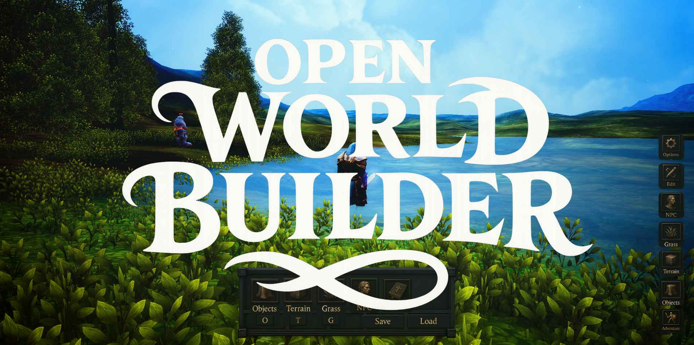

# Open World Builder

[Play in your browser](https://game.openworldbuilder.com/) instantly.

## Run Locally

`pnpm install`

`pnpm run dev`

Open the resulting link in browser.

## Debugging

### In-Game Inspector

Press `\` to open the in-game inspector.

### Switching Demo Levels

You can switch scenes by adding [`?scene=inn`](https://game.openworldbuilder.com?scene=inn).

## Deploying

`pnpm run build`

Upload all files in the `dist` folder.

## Contributing

Please feel free to contribute or open an issue. Anything that simplifies or lowers line count is greatly appreciated.
